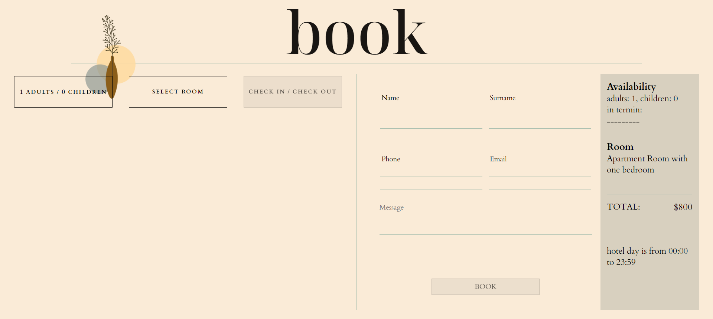

# Hotel

## Single-page application hotel site

application created to learn framework "React" and make single-page application

## Tech

- React 17.0.2
- Scss 1.49.9
- JavaScript
- Node 17.4.0
- Html 5

## Libraries

- react-calendar 3.7.0
- react-router-dom 6.2.2
- react-scroll-horizontal 1.6.6
- reactjs-popup 2.0.5

### Application was deploy on free account heroku because gitHub Pages had problems with SPA

#### [https://spa-hotel-site.herokuapp.com/]

 

## Some information about creating project :)

The hardest moments at create application were
when library react-router had new version and a had to make paths working. Second thing was add react-scroll-horizontal library and writed algorithm to smooth move after click when user use mouse wheel also set it to correct view after resize. Next was subpage 'contact" when i had to make a form contact which send a message to my email and validation to it. Subpage "book" still was the most harder. First i create button to add guest and algorithm which block
buttons addition or subtraction when adult had 1 or 4 ( one room in hotel has one bedroom or two bedroom, with double bed ).
But always have to be a one adult. Next block buttons when all added guests were 6 ( e.g. 1 adult and 5 child) but two of child had to be under 6 years. But it that was just the beginning, book.js and files import to it has about 1927 linie javascript.

## Getting Started with Create React App

This project was bootstrapped with [Create React App](https://github.com/facebook/create-react-app).

## Available Scripts

In the project directory, you can run:

### `npm start`

Runs the app in the development mode.\
Open [http://localhost:3000](http://localhost:3000) to view it in your browser.

The page will reload when you make changes.\
You may also see any lint errors in the console.

### `npm test`

Launches the test runner in the interactive watch mode.\
See the section about [running tests](https://facebook.github.io/create-react-app/docs/running-tests) for more information.

### `npm run build`

Builds the app for production to the `build` folder.\
It correctly bundles React in production mode and optimizes the build for the best performance.

The build is minified and the filenames include the hashes.\
Your app is ready to be deployed!

See the section about [deployment](https://facebook.github.io/create-react-app/docs/deployment) for more information.

### `npm run eject`

**Note: this is a one-way operation. Once you `eject`, you can't go back!**

If you aren't satisfied with the build tool and configuration choices, you can `eject` at any time. This command will remove the single build dependency from your project.

Instead, it will copy all the configuration files and the transitive dependencies (webpack, Babel, ESLint, etc) right into your project so you have full control over them. All of the commands except `eject` will still work, but they will point to the copied scripts so you can tweak them. At this point you're on your own.

You don't have to ever use `eject`. The curated feature set is suitable for small and middle deployments, and you shouldn't feel obligated to use this feature. However we understand that this tool wouldn't be useful if you couldn't customize it when you are ready for it.

## Learn More

You can learn more in the [Create React App documentation](https://facebook.github.io/create-react-app/docs/getting-started).

To learn React, check out the [React documentation](https://reactjs.org/).

### Code Splitting

This section has moved here: [https://facebook.github.io/create-react-app/docs/code-splitting](https://facebook.github.io/create-react-app/docs/code-splitting)

### Analyzing the Bundle Size

This section has moved here: [https://facebook.github.io/create-react-app/docs/analyzing-the-bundle-size](https://facebook.github.io/create-react-app/docs/analyzing-the-bundle-size)

### Making a Progressive Web App

This section has moved here: [https://facebook.github.io/create-react-app/docs/making-a-progressive-web-app](https://facebook.github.io/create-react-app/docs/making-a-progressive-web-app)

### Advanced Configuration

This section has moved here: [https://facebook.github.io/create-react-app/docs/advanced-configuration](https://facebook.github.io/create-react-app/docs/advanced-configuration)

### Deployment

This section has moved here: [https://facebook.github.io/create-react-app/docs/deployment](https://facebook.github.io/create-react-app/docs/deployment)

### `npm run build` fails to minify

This section has moved here: [https://facebook.github.io/create-react-app/docs/troubleshooting#npm-run-build-fails-to-minify](https://facebook.github.io/create-react-app/docs/troubleshooting#npm-run-build-fails-to-minify)
